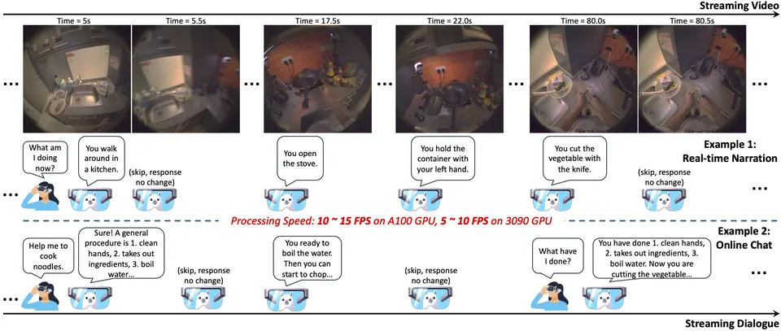

> 这是一篇**示例文章**，内容仅用于预览排版。以后写博客，只需要在 `src/content/posts/` 里新建一个 Markdown 文件——标题、日期、目录、阅读时长、公式和代码高亮都会自动生成。每篇文章都可以同时提供中文版和英文版。

## 为什么写博客

Papers are optimized for reviewers; blog posts can be optimized for readers. 论文需要严谨与完整，而博客可以记录那些没有写进论文的东西：失败的尝试、模糊的直觉，以及一个想法是怎么一点点长出来的。[^sidenote]

中文与 English 混排时，两种文字之间的间距会自动处理；标点悬挂、孤行控制这些细节也已经在样式里照顾到了。

## 公式

行内公式直接写 $\mathcal{O}(T)$ 或 $x_t \in \mathbb{R}^d$，块级公式用两个美元符号包起来。比如 test-time training 里最朴素的在线更新：

$$
W_t = W_{t-1} - \eta \, \nabla_{W}\, \ell\big(W_{t-1};\, x_t\big)
$$

以及大家都很熟悉的注意力：

$$
\operatorname{Attn}(Q, K, V) = \operatorname{softmax}\!\left(\frac{QK^{\top}}{\sqrt{d}}\right) V
$$

## 代码

代码块会按语言自动高亮，右上角可以一键复制：

```python
import torch


@torch.no_grad()
def stream(model, frames, fps: int = 2):
    """Feed frames one at a time and let the model decide when to speak."""
    cache = None
    for t, frame in enumerate(frames):
        out, cache = model.step(frame, past_key_values=cache)
        if out.should_respond:
            yield t / fps, out.text
```

## 图片与图注

图片下面的说明文字来自 Markdown 里的 alt 文本，不需要额外写 HTML：



## 表格

| Setting | Input | When to respond |
| --- | --- | --- |
| Offline | 完整视频 | 看完之后再回答 |
| Streaming | 逐帧到达 | 边看边决定是否开口 |
| Full-duplex | 音视频流 | 随时可以被打断、随时回应 |

## 列表、脚注与引用

- 支持有序 / 无序列表、`inline code` 和 **粗体**、*斜体*；
- 脚注会自动编号[^footnote]，宽屏下显示在页边；
- 深色模式、RSS 订阅、代码高亮都是开箱即用的。

> The best way to have a good idea is to have a lot of ideas.
> — Linus Pauling

[^sidenote]: 这是一条旁注。宽屏时它出现在正文右侧，窄屏时点击上标数字展开。
[^footnote]: 脚注写法和 GitHub 一致：正文里写 `[^name]`，文末写定义即可。
